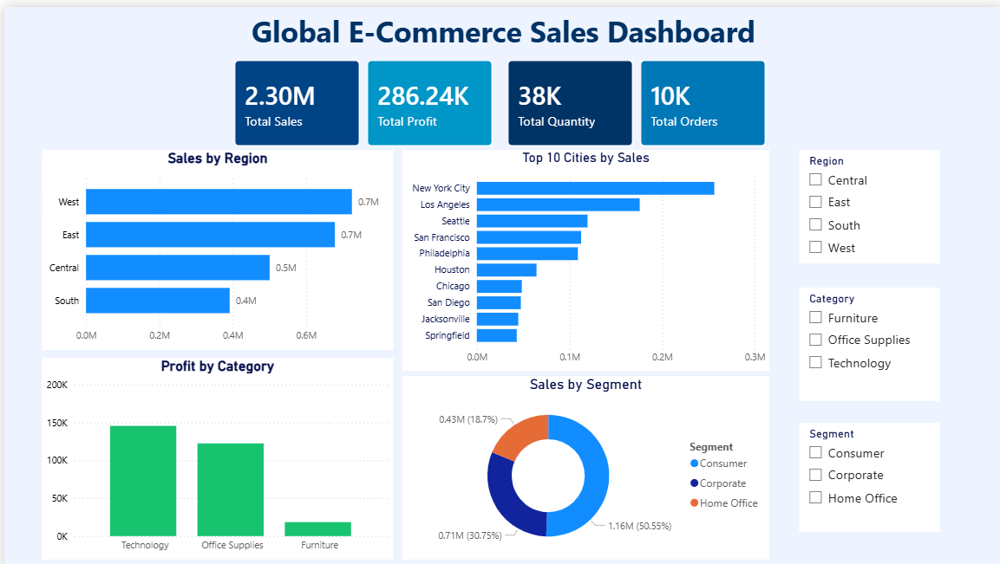

# Global E-Commerce Sales Dashboard

## Project Overview
This project analyzes retail sales data using Excel, SQL, and Power BI.

## Tools Used
- Excel
- MySQL
- Power BI

## Dataset
Sample Superstore Dataset

Records Analyzed: 9,977

## Dashboard Features
- KPI Cards (Sales, Profit, Quantity, Orders)
- Sales by Region
- Profit by Category
- Sales by Segment
- Top 10 Cities by Sales
- Interactive Slicers

## Key Insights
- West Region generated the highest sales.
- Technology category generated the highest profit.
- Consumer segment contributed over 50% of total sales.
- New York City recorded the highest sales.
- Furniture generated the lowest profit among all categories.

## Dashboard Preview

